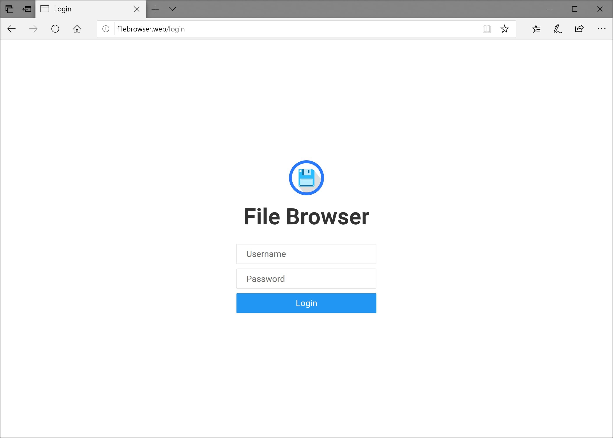
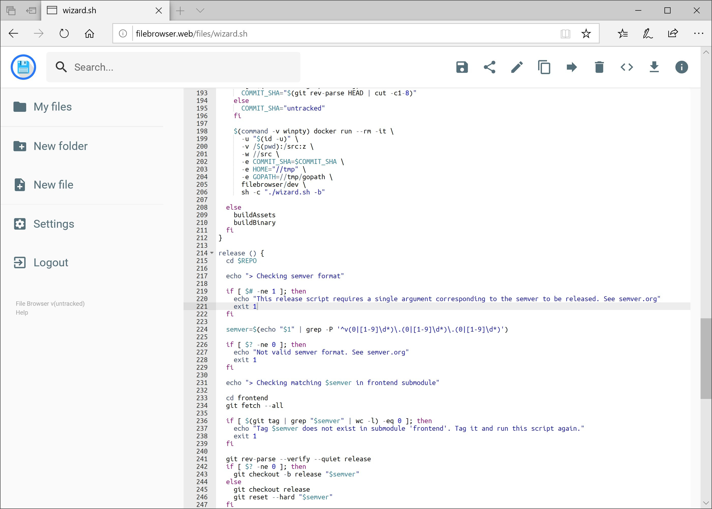

<p align="center">
  
</p>


[](https://github.com/filebrowser/filebrowser/actions/workflows/main.yaml)
[](https://goreportcard.com/report/github.com/filebrowser/filebrowser)
[](http://godoc.org/github.com/filebrowser/filebrowser)
[](https://github.com/filebrowser/filebrowser/releases/latest)
[](http://webchat.freenode.net/?channels=%23filebrowser)

filebrowser provides a file managing interface within a specified directory and it can be used to upload, delete, preview, rename and edit your files. It allows the creation of multiple users and each user can have its own directory. It can be used as a standalone app.

> [!WARNING]
>
> This project is currently on **maintenance-only** mode, and is looking for new maintainers. For more information, please read the [discussion #4906](https://github.com/filebrowser/filebrowser/discussions/4906). Therefore, please note the following:
>
> - It can take a while until someone gets back to you. Please be patient.
> - [Issues][issues] are only being used to track bugs. Any unrelated issues will be converted into a [discussion][discussions].
> - No new features will be implemented until further notice. The priority is on triaging issues and merge bug fixes.
> 
> If you're interested in maintaining this project, please reach out via the discussion above.

[issues]: https://github.com/filebrowser/filebrowser/issues
[discussions]: https://github.com/filebrowser/filebrowser/discussions

## Features

File Browser is a **create-your-own-cloud-kind** of software where you can install it on a server, direct it to a path and then access your files through a nice web interface. You have many available features!

|    Easy Login System     |     Sleek Interface      |     User Management      |
| :----------------------: | :----------------------: | :----------------------: |
|  |  |  |


|       File Editing       |     Custom Commands      |      Customization       |
| :----------------------: | :----------------------: | :----------------------: |
|  |  |  |

## 源码增强功能 (Enhanced Features)

基于原版 File Browser，本项目在源码基础上进行了以下重要增强：

### 1. 文件列表增强显示

**功能描述：** 在文件列表中新增了 "拥有者" 和 "权限" 两列，提供更详细的文件系统信息。

**实现思路：**
- 后端：扩展文件信息结构体，添加 `Owner` 和 `Perm` 字段
- 前端：修改文件列表组件，增加对应的表格列显示

**相关文件修改：**
- `files/file.go` - 扩展文件信息获取逻辑
- `frontend/src/components/files/Listing.vue` - 前端列表显示组件

### 2. 文件夹大小信息显示

**功能描述：** 在文件夹的详细信息（info）中显示文件夹的总大小，包含所有子文件和子文件夹。

**实现思路：**
- 递归遍历文件夹结构计算总大小
- 采用异步计算避免阻塞主线程

### 3. 移动端编辑器自适应

**功能描述：** 编辑器在移动设备上自动切换为简单文本编辑模式，解决 ACE 编辑器在移动设备上操作困难的问题。

**实现思路：**
- 设备检测：通过 User Agent 和屏幕宽度判断移动设备
- 自动切换：移动设备默认使用 textarea，桌面设备使用 ACE 编辑器
- 保留手动切换功能，用户可根据需要在两种模式间切换

**检测逻辑：**
```javascript
const isMobile = () => {
  return /Android|webOS|iPhone|iPad|iPod|BlackBerry|IEMobile|Opera Mini/i.test(navigator.userAgent) || 
         window.innerWidth <= 768;
};
```

**相关文件：**
- `frontend/src/views/files/Editor.vue` - 编辑器主组件

### 4. OnlyOffice 文档预览与编辑

**功能描述：** 集成 OnlyOffice 文档服务器，支持 Word、Excel、PowerPoint 等 Office 文档的在线预览和编辑。

**架构设计：**
- **后端集成：** 新增 OnlyOffice 配置和 API 接口
- **前端组件：** 嵌入 OnlyOffice 编辑器组件
- **设置管理：** 管理员可配置 OnlyOffice 服务器地址
- **文件支持：** 支持 .docx, .xlsx, .pptx 等主流格式

**实现要点：**

1. **后端配置结构：**
   ```go
   type OnlyOfficeConfig struct {
       Enabled bool   `json:"enabled"`
       Host     string `json:"host"`
       JwtSecret string `json:"jwtSecret"`
   }
   ```

2. **前端设置界面：**
   - 启用/禁用 OnlyOffice 集成的开关
   - OnlyOffice 服务器地址配置
   - 支持的文件格式说明

3. **文档编辑流程：**
   - 检测文件类型是否支持 OnlyOffice
   - 生成临时访问令牌和回调 URL
   - 嵌入 OnlyOffice 编辑器并加载文档
   - 处理文档保存回调

4. **API 接口说明：**
   - **`/api/onlyoffice/mapping`** (POST)
     - 功能：获取 OnlyOffice 编辑器配置
     - 请求参数：文件路径、用户ID、来源域名
     - 返回：完整的 OnlyOffice 配置对象（包含文档信息、编辑器配置、JWT令牌等）
     - 用途：前端初始化 OnlyOffice 编辑器时调用
   
   - **`/api/onlyoffice/callback`** (POST)
     - 功能：处理 OnlyOffice 文档服务器的回调
     - 请求参数：文档状态、下载URL、用户操作等
     - 返回：处理结果状态
     - 用途：文档编辑完成后自动保存到文件系统

**Docker 部署示例：**
```bash
# 启动 OnlyOffice 文档服务器
docker run -d --name onlyoffice-docs \
  -p 6066:80 \
  -e JWT_ENABLED=true \
  -e JWT_SECRET=xxxxxxxx \
  onlyoffice/documentserver
```

**相关文件修改：**
- `settings/settings.go` - 添加 OnlyOffice 配置
- `http/onlyoffice.go` - OnlyOffice API 接口
- `frontend/src/views/settings/Global.vue` - 设置界面

### 技术栈说明

- **后端：** Go 1.23, 基于原有架构扩展
- **前端：** Vue 3 + TypeScript, 保持原有技术栈
- **文档服务：** OnlyOffice Document Server
- **部署：** 支持 Docker 容器化部署

### 配置说明

所有新增功能都提供了相应的配置选项，管理员可以根据需要启用或禁用特定功能。OnlyOffice 功能需要额外部署文档服务器，其他功能开箱即用。

## Install

For information on how to install File Browser, please check [docs/installation.md](./docs/installation.md).

## Configuration

For information on how to configure File Browser, please check [docs/configuration.md](./docs/configuration.md).

## Contributing

For information on how to contribute to the project, including how translations are managed, please check [docs/contributing.md](./docs/contributing.md).
